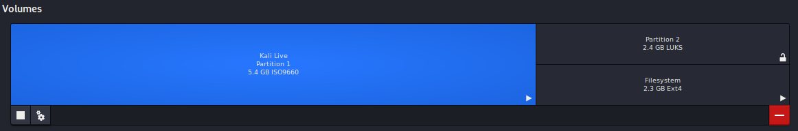
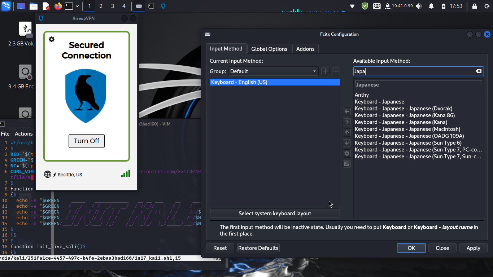

# Kali Live whith Encryption Storage
## はじめに - Live環境の有用性
Kali Live USB/DVDは、プライバシーやセキュリティを重視する上で非常に有効な方法です。RAMメモリ上にOSを展開し動作する事で、シャットダウン後すべてのデータは消去されます。開いたWebサイトやコンピュータの操作履歴といった痕跡を一切残しません。またこのような特性上、しばし公共のPCや信頼できないコンピュータの操作以外にもアクセス権を持たないコンピュータの操縦を可能とする他、OSINT調査や即応的な攻撃にも転用できる事を踏まえてもOPSECやOffensiv Securityの観点から見て望ましいと言えます。

しかしこのような揮発的性格から永続的な記録を行う事ができず、Live USB以上のデータを持ち歩く事もできません。そこでTailsから着想を得る形で、データ侵害に強い暗号化済み書き込み可能領域を備えたKali Live USBを作成する方法とそれを実現する為のデータを本リポジトリで提供提供します。また暗号化済み領域を復号して認識させることにより、普段使用しているコンピュータとLive USBの間でファイルの共有や編集が実現できます。Live環境は保存領域へのアクセスと編集を可能とするOS環境でしかありません。

## 用意するもの
- Kali Linux Live版 iso(執筆時点の最新版は[2024.3](https://cdimage.kali.org/kali-2024.3/))
- 7.0GB以上のUSBメモリー
- 何らかのLinux環境(ROM焼きとcryptsetup実行に必要)

## Live USBと暗号化済みストレージの作成
まず7.0GB以上のUSBをフォーマットしパーティションを切ります。今回は7.2GBのUSBを例として解説するので2.2GBを記憶領域に割り当てとりあえずフォーマットします。すると5GBの領域が自然に生まれるのでそちらも同じくフォーマットします。Kali Live isoのファイルサイズは4.3GBなのでLive領域は5GBで十分です。

### フォーマットと領域作成
作業が整い次第次の手順で2.2GB領域に暗号化済み領域を作成します。この作業はLive USBの紛失や盗難などによって保存領域に保存したデータが侵害される事を防ぐ為の処置です。

USBのデバイス名は周辺機器や環境によって`/dev/sdb`であったり`/dev/sdc`など変動するので`/dev/sdX`と呼称します(lsblk -fで確認できます)。

```bash
cryptsetup luksFormat --type luks2 --cipher aes-xts-plain64 --hash sha512 --iter-time 2000 --key-size 512 --pbkdf argon2id --use-urandom --verify-passphrase /dev/sdX2
```

このコマンドを実行すると次のような出力結果を得ると思いますが、以下の手順に従ってください。

```
WARNING!
========
This will overwrite data on /dev/sdX2 irrevocably.

Are you sure? (Type uppercase yes): YES #筆者注:大文字で入力
Enter passphrase for /dev/sdX2: #筆者注:パスワード設定入力しても表示されない
Verify passphrase: #パスワードの確認。もう一度入力
```

### 暗号化領域のマッピングとマウント

```bash
## 領域復号
cryptsetup luksOpen /dev/sdX2 kali-encryption-storage
## マウント
mount /dev/mapper/kali-encryption-storage /mnt/kali-storage

## 領域のフォーマット(初回のみ)
mkfs.ext4 /dev/mapper/kali-encryption-storage
```

アンマウントおよびマッピングの終了は以下のとおりです。

```bash
## アンマウント
umount /mnt/kali-storage
## マッピング終了
cryprsetup luksClose kali-encryption-storage
```

### データ保存領域のとKali Live USB本体のセットアップ
`/mnt/kali-storage`に移りターミナルから`git clone https://github.com/Extr3m4R4710/create-kali-live-usb-whith-encryption-storage`を実行してください。まっさらなKali Live環境を初期化する`1n17_ka11.sh`と必要なコンポーネントと実用に即したフォルダがクローンされます。

その後5GB領域(/dev/sdX1)へ執筆時点で最新の`kali-linux-2024.3-live-amd64.iso`を`必ずcpコマンドでROM焼き`してください。ddやその他イメージライターは絶対に使わないのでください。USB全体が上書きされてしまう為です。

```bash
cp -v /path/to/kali-linux-2024.3-live-amd64.iso /dev/sdX1
```

Live領域作成後、図のように完成していれば成功です。この図では一旦Live USBの主記憶領域を復号化してマウントしています。


## 作成したLive USBの使い方
BIOSかUEFIをUSBブート可能な状態にセットアップする必要があります。特にここでは解説しませんが、解説が必要な場合「Live USB ブート 方法」で検索してください。すべてそこにあります。

ユーザー名、パスワード共に`kali`でログインできます(一応書いておく)。

ログイン後はWifiに接続しデスクトップに表示された先程セットアップした暗号化された記憶領域(ここでは2GB程)をクリック。パスフレーズ認証が始まるので、設定したパスフレーズを入力すると自動的に領域をマウントできます。そこから開いたファイルマネージャーを右クリックでもいいのでターミナルを立ち上げ、データ保存領域内の`1n17_ka11.sh`を実行しセットアップします。`必ずroot権限で実行してください`

```bash
sudo bash ./1n17_ka11.sh
```

初期化シェルスクリプトを実行する事で`ノーログVPNやtor`の他`日本語入力IME、gpg、keepassxc(パスワードマネージャー)、sn0int、proxychains-ng`を自動でインストールされます。その他、個人プロジェクトで開発している`script_vox`ツールキットが自動でクローンされます。

本Live環境は永続化されたUSBと一体のストレージを除き、コンピュータ自体を使用した物理的な痕跡をセッション終了後に削除しプライバシーや匿名性を保護しますが、通信データは保護されません。通信の保護・秘匿が必要な場合、インストールされた`Riseup-VPN`を使用するか`script_vox`に収録された`Net-Spectre`ですべてTorを介して行うべきです。proxychainsでプログラム単位でtorを使用することもできます。

セットアップ終了後一旦ログアウトしもう再度ログインすることでVPNと日本語入力環境が使用できます。


## 余談
今回はKali Linuxを使っていますが、`1n17_ka11.sh`は主に`curl`、`apt`、`git`で構成されているのでパッケージ名の整合性さえ取れたらParrotOSやBackBoxでも動作します。つまりLive領域にOSを割り当てさえすれば理屈の上ではどんなOSでも動きます。
